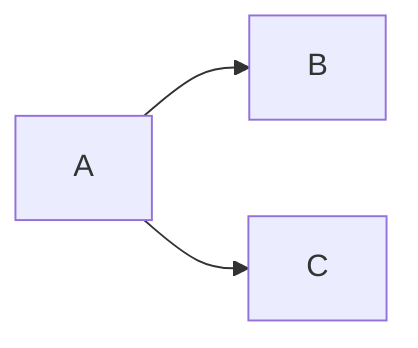

### 统计学
统计学可以北定义为一组由收集数据，分析数据，由数据得出结论而组成的概念、原则和方法

### 统计学的主要思想
随机性和规律性：关系密切的孪生子

### 数据分析
三种方式：图 表 计算

分类变量 度量变量

### 计算汇总量
众数 中位数 均值 极差

标准差说明了观察值与均值相差多远

均值加减一个标准差的值包含所有观测值的66.66%

由原始观察值算出的叫做标准差 ，由一组均值算出的叫做标准误差

标准化

### 概率
利用主观概率

一次事件的概率叫主观概率

### 估计
统计推断 估计 假设检验组成

